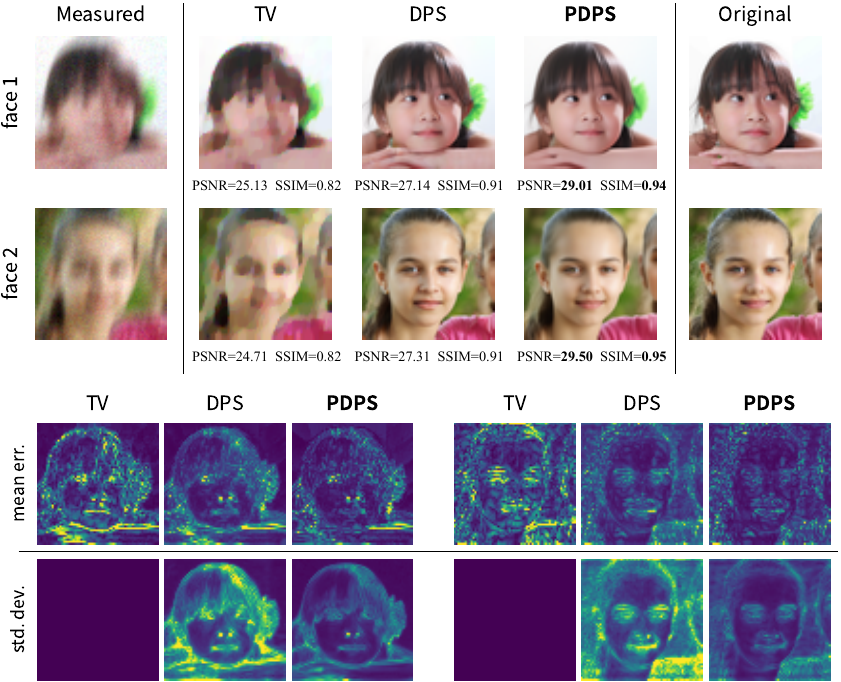
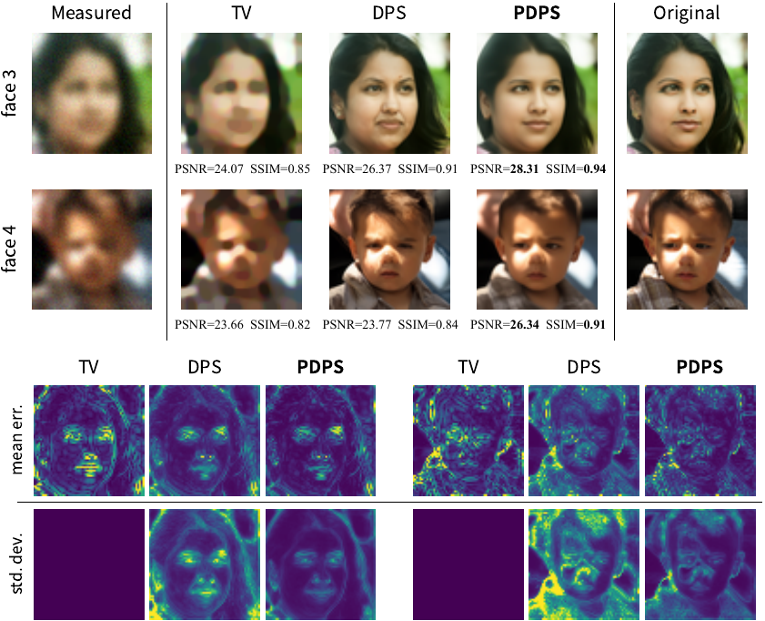
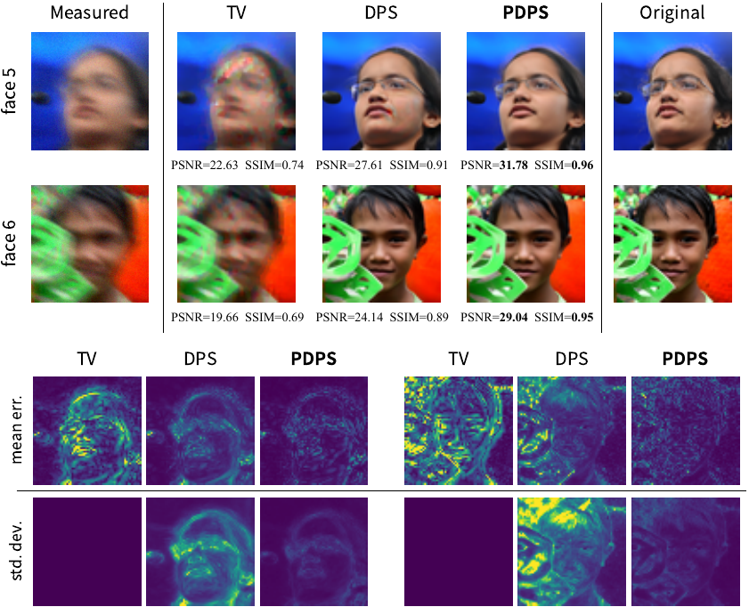
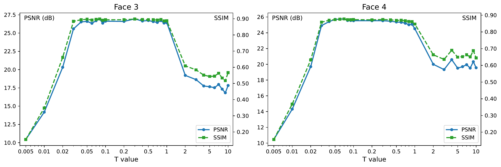

# Official Implementation of [Provable Diffusion Posterior Sampling for Bayesian Inversion](https://arxiv.org/abs/2512.08022)

**Authors:** [Jinyuan Chang](https://sites.google.com/site/bryanchangjinyuan/), [Chenguang Duan](https://chenguangduan.github.io), [Yuling Jiao](https://jszy.whu.edu.cn/jiaoyuling/en/index.htm), Ruoxuan Li, Jerry Zhijian Yang, and [Cheng Yuan](https://scholar.google.com/citations?user=UFL4YUwAAAAJ&hl=en)

PDPS is a plug-and-play diffusion method for Bayesian inverse problems. It uses Langevin dynamics and a pretrained prior score to estimate the posterior score without the heuristic likelihood approximations common in diffusion posterior sampling, together with a warm start for the reverse process. This repository provides PDPS and the DPS and proximal-gradient TV baselines used in the paper.

## Results

### Reconstruction and uncertainty quantification

The examples below compare the measured input, TV, DPS, and PDPS with the ground truth. The bottom rows show pixel-wise mean absolute error and standard deviation; the stochastic methods use 24 independent runs, while TV is deterministic.

<p align="center">
  <a href="assets/motion.png"></a>
  <a href="assets/gaussian.png"></a>
</p>
<p align="center"><em>Motion deblurring (left) and Gaussian deblurring (right).</em></p>

<p align="center">
  <a href="assets/nonlinear.png"></a>
</p>
<p align="center"><em>Nonlinear deblurring.</em></p>

### Quantitative comparison

Average PSNR and SSIM over 128 FFHQ64 images:

| Task | Metric | TV | DPS | **PDPS** |
| :-- | :--: | --: | --: | --: |
| Gaussian deblurring | PSNR | 23.98 | 24.38 | **26.42** |
| | SSIM | 0.77 | 0.82 | **0.87** |
| Motion deblurring | PSNR | 24.94 | 26.83 | **28.86** |
| | SSIM | 0.81 | 0.88 | **0.92** |
| Nonlinear deblurring | PSNR | 18.66 | 20.96 | **28.44** |
| | SSIM | 0.48 | 0.69 | **0.91** |

### Terminal-time ablation

The Gaussian-deblurring ablation shows a stable high-performance region for terminal times approximately between `0.05` and `1.0`. All runs in this plot use `T0=0.001`.

<p align="center">
  <a href="assets/ablation.png"></a>
</p>

## Installation

Python 3.9 is the supported environment. Install the pinned dependency set from the repository root:

```bash
python -m pip install -r requirements.txt
python -m pip check
```

Install the requirements together: installing DeepInv separately may upgrade PyTorch to an incompatible version.

## Pretrained Models

Download the EDM prior required by PDPS and DPS:

```bash
wget https://nvlabs-fi-cdn.nvidia.com/edm/pretrained/edm-ffhq-64x64-uncond-ve.pkl \
  -P data/nn/edm/
```

For `nonlinear_deblur`, download [GOPRO_wVAE.pth](https://drive.google.com/file/d/1vRoDpIsrTRYZKsOMPNbPcMtFDpCT6Foy/view?usp=drive_link) and place it at:

```text
src/likelihood/utils/bkse/experiments/pretrained/GOPRO_wVAE.pth
```

## Reproducing Paper Results

Run a paper preset from the repository root:

```bash
python pdps.py --paper -d ffhq -m single -t gaussian_deblur -i 097
python dps.py  --paper -d ffhq -m single -t gaussian_deblur -i 097
python tv.py   --paper -d ffhq -m single -t gaussian_deblur -i 097
```

The available tasks are `gaussian_deblur`, `motion_deblur`, and `nonlinear_deblur`. Add `--eval` to compute PSNR/SSIM, use `-m batch` for a dataset run, and consult `python pdps.py --help` (or the corresponding entry script) for custom parameters. GPU selection follows `CUDA_VISIBLE_DEVICES`; `--batch-chunk-size` can limit memory use in batch mode.

## Outputs and Reproducibility

Paper and custom runs are written to:

```text
fig/{method}/paper/{mode}/{operator}/{dataset_or_image}/
fig/{method}/custom/{mode}/{operator}/{dataset_or_image}/{fingerprint}/
```

Each run records its effective configuration, seeds, environment, GPU partition, and expected outputs in `run.json`. Evaluation writes `metrics.txt`. Existing matching runs can be continued with `--resume` or replaced with `--overwrite`.

For a same-machine deterministic rerun, reuse the recorded `--seed` and `--measurement-seed` and add `--strict-deterministic`. Bitwise equality is not guaranteed across different software versions, GPU models, or GPU partitions.

> [!NOTE]
> `--paper` selects the released cases and parameter presets, but it does not promise pixel-identical regeneration of the frozen historical PDPS figures and table entries. Their original sampling seeds were not retained, and the current implementation executes the corrected complete `N_rev` reverse grid. The TV preset is the corrected proximal-gradient baseline rather than a bit-for-bit replay of the legacy TV script.

## Repository Structure

```text
PDPS/
├── pdps.py, dps.py, tv.py      # Method entry points
├── configs/                    # Paper presets and custom configurations
└── src/
    ├── cli.py                  # Shared command-line interface
    ├── core/                   # Execution and run manifests
    ├── samplers/               # PDPS, DPS, and TV implementations
    ├── prior/                  # EDM prior interface
    ├── likelihood/             # Operators and likelihoods
    └── utils/                  # I/O, metrics, and postprocessing
```

## Adding New Methods

A new method needs a configuration in `configs/`, a sampler in `src/samplers/`, and a top-level entry script. Register it in `configs/__init__.py` and `src/samplers/__init__.py`; the shared execution, output, and evaluation layers can then be reused.

## Acknowledgements

This implementation builds on [EDM](https://github.com/NVlabs/edm), [DPS](https://github.com/DPS2022/diffusion-posterior-sampling), and [DeepInv](https://github.com/deepinv/deepinv). The methodology is also closely related to [Stochastic Localization via Iterative Posterior Sampling (SLIPS)](https://proceedings.mlr.press/v235/grenioux24a.html).

## Citation

If you find this code useful, please cite:

```bibtex
@misc{chang2025provable,
  title         = {Provable Diffusion Posterior Sampling for {B}ayesian Inversion},
  author        = {Jinyuan Chang and Chenguang Duan and Yuling Jiao and Ruoxuan Li and Jerry Zhijian Yang and Cheng Yuan},
  year          = {2025},
  eprint        = {2512.08022},
  archivePrefix = {arXiv},
  primaryClass  = {stat.ML},
  url           = {https://arxiv.org/abs/2512.08022}
}
```
